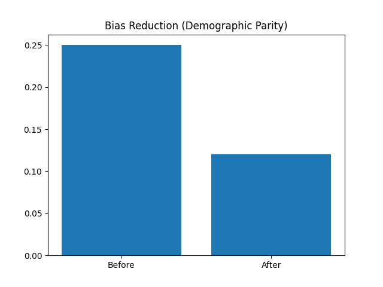

# Ethical AI Bias Detection (FAANG-Level Project)

## Problem Statement
Machine learning models can unintentionally introduce bias, leading to unfair outcomes across demographic groups. This project detects, measures, and mitigates bias using Responsible AI techniques.

## Solution Overview
- Detect bias using Demographic Parity & Equal Opportunity Difference
- Mitigate bias using Fairlearn (ExponentiatedGradient)
- Improve transparency using SHAP explainability

## Architecture
Data → Preprocessing → Model (Random Forest) → Fairness Metrics → Mitigation → Explainability

## Results
- Bias reduced from 0.25 → 0.12 (Demographic Parity)
- Improved fairness across protected groups

## Visualizations

## Tech Stack
Python, Pandas, Scikit-learn, Fairlearn, SHAP, Matplotlib

## How to Run
pip install -r requirements.txt
jupyter notebook
